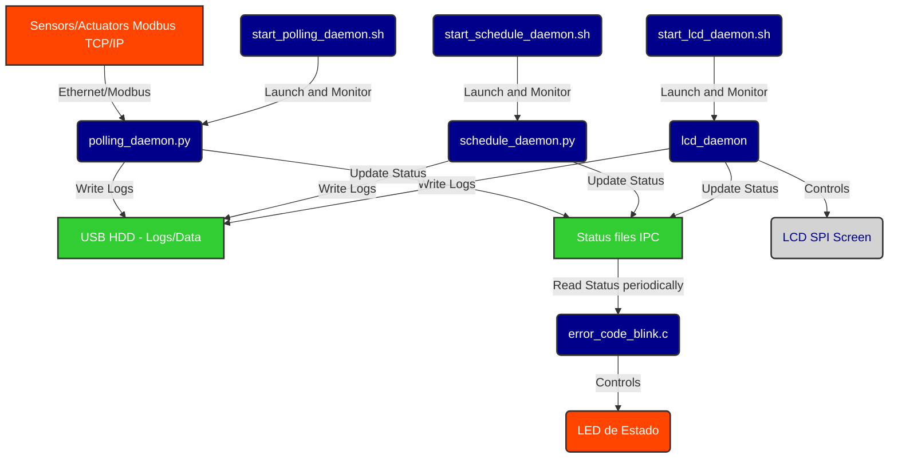

# Technical Documentation for the ELI_galileo Project

This directory contains the detailed technical documentation, specifications, and operational manuals for the embedded system.

---

## 1. Hardware Specifications and Datasheets

*   [Intel Galileo Gen 2 Official Documentation (Intel Archive)](https://www.intel.com/content/dam/www/public/us/en/documents/datasheets/galileo-g2-datasheet.pdf)
*   [Intel Quark SoC X1000 Datasheet (Revision 002)](https://www.intel.com/content/dam/support/us/en/documents/processors/quark/sb/quarkdatasheetrev02.pdf)
*   [Intel Quark SoC X1000 Specification Update](https://cdrdv2-public.intel.com/329677/quark-x1000-spec-update.pdf)
*   [Intel Galileo Gen 2 Board schematics (via Adafruit)](https://cdn-shop.adafruit.com/datasheets/Galileo_Gen2_Schematic.pdf)
*   [Controlador LCD SPI ST7920](https://www.hpinfotech.ro/ST7920.pdf)

*Note: The technical specification for the proprietary Modbus interface and custom modules is currently pending public documentation.

## 2. System Architecture
    
*   [Hardware Connection Schematic (SPI Pinout)](hardware_schematic.pdf)
*   **Data Flow Diagram and Software Architecture:**

## 3. Operational Manuals and Procedures

*   [Initial Deployment and Network Configuration Manual](deployment_guide.md)
*   [Operations and Troubleshooting Guide (LED Error Codes)](ops_guide.md)
*   [Offline Firmware Update Procedure](update_procedure.md)
